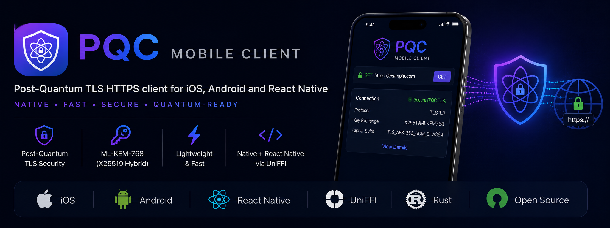

<p align="center">
  
</p>

# PQC Mobile Client

[](https://github.com/sriharsha-y/pqc-mobile-client/actions/workflows/check.yml)
[](https://github.com/sriharsha-y/pqc-mobile-client/actions/workflows/android.yml)
[](https://github.com/sriharsha-y/pqc-mobile-client/actions/workflows/ios.yml)
[](https://github.com/sriharsha-y/pqc-mobile-client/releases)
[](https://central.sonatype.com/artifact/io.github.sriharsha-y/pqc-mobile-client)
[](https://cocoapods.org/pods/PqcCore)
[](LICENSE)

Post-Quantum TLS HTTPS client for mobile — **iOS 13+** and **Android API 24+**. A single Rust core (`rustls` + `rustls-post-quantum` + `aws-lc-rs` + `reqwest`) exposed to **Kotlin and Swift** via UniFFI, so native iOS, native Android, and React Native apps can negotiate the **`X25519MLKEM768`** hybrid (IANA `0x11EC`) against PQC-enabled servers on OS versions that don't have native PQC TLS yet.

## Why

Akamai, Cloudflare, and AWS edges already negotiate hybrid PQC TLS (`X25519MLKEM768`). iOS 26+ and Chrome do too — but most shipped mobile OSes don't:

- **iOS 13–18** — no native PQC TLS; `URLSession`'s TLS engine is closed and doesn't expose group selection.
- **Android Conscrypt** — `X25519MLKEM768` only landed upstream as a non-default, opt-in named group in `2.6-alpha` (May 2026); no stable Conscrypt release ships it, it is off by default (only `X25519`/`P-256`/`P-384` are default), and reaching it requires bundling the standalone library and calling `SSLParameters.setNamedGroups`. The updatable *system* Conscrypt module that backs `javax.net.ssl` lags further behind, with no committed default-on date.
- **Cronet** — its Chromium net stack does contain `X25519MLKEM768` (the `cronet-embedded` artifact was revived at Chrome 141/143 in late-2025/early-2026, so it is no longer frozen), but `CronetEngine.Builder` exposes **no public API for TLS group selection**, the only lever is the unstable `setExperimentalOptions` JSON, and PQC is not confirmed on-by-default in the embedded build. The reliably PQC-capable path remains GMS-delivered Cronet, which excludes non-GMS devices.

This crate is a **unified, single-codebase** alternative that works on every supported OS version and on every Android device regardless of GMS availability — with PQC on by default, no dependence on Google Play Services, and built on FIPS-capable crypto (`aws-lc-rs` / AWS-LC, validatable via its `fips` feature). _(Conscrypt/Cronet landscape verified 2026-05; both are moving fast, so re-check before relying on these specifics.)_

## Install

**Android — Maven Central**

```kotlin
implementation("io.github.sriharsha-y:pqc-mobile-client:0.5.3") // x-release-please-version
```

**iOS — CocoaPods**

```ruby
pod 'PqcCore', '~> 0.5.3' # x-release-please-version
```

**iOS — Swift Package Manager**

```swift
.package(url: "https://github.com/sriharsha-y/pqc-mobile-client.git", from: "0.5.3") // x-release-please-version
```

The Android AAR is self-contained — it bundles the native `.so` files, the generated Kotlin bindings, and the `rustls-platform-verifier` glue, so no extra repositories or manual wiring are needed. Full setup (including the one-time `PqcAndroidInit.init` call) is in the [Android](docs/android.md) and [iOS](docs/ios.md) guides.

## Usage

Most apps wire this into their existing HTTP stack — an **OkHttp `Interceptor`** on Android or a **`URLProtocol`** on iOS — so the rest of the app keeps using its normal networking API. You can also call it directly:

**Kotlin** (Android)

```kotlin
import io.github.sriharsha_y.pqc.*

// Once, in Application.onCreate, before constructing any client:
PqcAndroidInit.init(this)

// Constructor throws PqcException on bad config (e.g. a malformed pin):
val client = PqcHttpClient(PqcConfig(
    pinnedCertSha256 = emptyList(),   // SPKI pins; empty = platform trust only
    enablePostQuantum = true,
    defaultTimeoutMs = 15_000UL,
    connectTimeoutMs = null,          // 10s default
    maxBodyBytes = null,              // 16 MiB default
    enableCookies = false,
    userAgent = "MyApp/1.0",
    redirectPolicy = RedirectPolicy.SameOriginOnly,
))

val resp = runBlocking {
    client.request(HttpRequest(
        method = HttpMethod.GET,
        url = "https://example.com",
        headers = emptyMap(),
        body = null,
        timeoutMs = null,
    ))
}
println("status=${resp.status} alpn=${resp.negotiatedProtocol}")
```

**Swift** (iOS)

```swift
import PqcCore

let client = try PqcHttpClient(config: PqcConfig(
    pinnedCertSha256: [],
    enablePostQuantum: true,
    defaultTimeoutMs: 15_000,
    connectTimeoutMs: nil,
    maxBodyBytes: nil,
    enableCookies: false,
    userAgent: "MyApp/1.0",
    redirectPolicy: .sameOriginOnly))

let resp = try await client.request(req: HttpRequest(
    method: .get, url: "https://example.com",
    headers: [:], body: nil, timeoutMs: nil))
print("status=\(resp.status) alpn=\(resp.negotiatedProtocol)")
```

## Documentation

| Topic | Link |
|---|---|
| Android integration (OkHttp / Retrofit / Ktor / React Native) | [`docs/android.md`](docs/android.md) |
| iOS integration (`URLSession` / `URLProtocol` / React Native) | [`docs/ios.md`](docs/ios.md) |
| Runnable React Native sample app | [`examples/RnSample`](examples/RnSample) |
| Contributing & release flow | [`CONTRIBUTING.md`](CONTRIBUTING.md) |
| Security policy | [`SECURITY.md`](SECURITY.md) |

## How it works

The same Rust core ships to every consumer; only the integration glue at the call site differs.

```
   Consumer app (native iOS / native Android / React Native)
                 │
        ┌────────┴────────┐
        ▼                 ▼
  Kotlin bindings   Swift bindings
   (UniFFI)          (UniFFI)
        │                 │
   libpqc_client.so    PqcCore.xcframework
        └────────┬────────┘
                 ▼
   ┌─────────────────────────────────────────┐
   │  pqc_client (this crate)                  │
   │  reqwest ─ hyper ─ rustls                 │
   │  rustls-post-quantum (X25519MLKEM768)     │
   │  aws-lc-rs (FIPS-capable)                 │
   │  rustls-platform-verifier                 │
   │  tokio                                     │
   └─────────────────────────────────────────┘
```

| Consumer | Integration pattern | Guide |
|---|---|---|
| Native Android (OkHttp / Retrofit / Ktor) | Custom `Interceptor` delegating to `PqcHttpClient` | [`docs/android.md`](docs/android.md) §3 |
| Native Android (`HttpURLConnection` / no framework) | Call `PqcHttpClient` directly | [`docs/android.md`](docs/android.md) §6 |
| React Native Android | Same `Interceptor` via `OkHttpClientProvider` | [`docs/android.md`](docs/android.md) §5 |
| Native iOS (`URLSession`) | Register `PqcURLProtocol` on the session config | [`docs/ios.md`](docs/ios.md) §3 |
| Native iOS (custom HTTP client) | Call `PqcHttpClient` directly | [`docs/ios.md`](docs/ios.md) §5 |
| React Native iOS | `PqcURLProtocol` via `RCTSetCustomNSURLSessionConfigurationProvider` | [`docs/ios.md`](docs/ios.md) §6 |

## Features

| Capability | Status |
|---|---|
| Hybrid PQC TLS (`X25519MLKEM768`) | ✅ Default |
| Classical fallback (X25519, P-256) | ✅ Automatic |
| HTTP/1.1, HTTP/2 | ✅ via reqwest + hyper |
| System trust store (iOS Keychain / Android KeyStore) | ✅ via `rustls-platform-verifier` |
| Cert pinning (SPKI SHA-256, any cert in chain) | ✅ Layered on platform verifier; empty list disables |
| Cookies | ✅ Opt-in via `enableCookies`; off by default |
| gzip / brotli | ✅ Body capped via `maxBodyBytes` (16 MiB default) to defuse decompression bombs |
| Redirects | ✅ `SameOriginOnly` default; also `NoRedirects` / `Limited(max)` |
| Timeouts (connect / total) | ✅ Separated so connect fails fast on cell handover |
| Connection pooling | ✅ |
| All HTTP methods | ✅ GET, POST, PUT, DELETE, PATCH, HEAD, OPTIONS |
| ALPN reported on `HttpResponse` | ✅ `negotiatedProtocol` per request (confirm the KEX **group** server-side via `/cdn-cgi/trace` `kex=`) |
| Android GMS + non-GMS, iOS 13–18, iOS 26+ | ✅ (on iOS 26+ defer to native `URLSession` via `#available`) |
| HTTP/3 / QUIC | ❌ Not supported |

## Not covered

- **WebViews** (`WKWebView`, system WebView) — use the system network stack, not interceptable.
- **iOS background `URLSession`** — the OS daemon owns the socket.
- **RN image loaders / 3rd-party native SDKs** (Fresco, SDWebImage, Firebase, Sentry, …) — bundle their own HTTP clients.
- **Streaming bodies larger than a few MB** — possible but needs extra FFI plumbing; not in scope.

## Building from source

For contributors working on the crate itself — consumers should use the package managers above. Requires Rust (plus the Android NDK / Xcode for the mobile builds).

```bash
make setup      # one-time: rustup targets + cargo-ndk
make check      # fmt + clippy + tests (mirrors CI)
make android    # cross-compile all ABIs + Kotlin bindings
make ios        # build the XCFramework + Swift bindings
make help       # list all targets
```

## Releases

Automated by [release-please](https://github.com/googleapis/release-please) from conventional commits on `main`: merging the generated release PR tags `vX.Y.Z`, cuts the GitHub Release, and publishes to Maven Central, CocoaPods Trunk, and SwiftPM. No manual tagging. See [CONTRIBUTING.md](CONTRIBUTING.md).

## Dependencies

| Crate | Purpose |
|---|---|
| `reqwest` | HTTP client (redirects, cookies, gzip/brotli, pooling, HTTP/2) |
| `rustls` | Pure-Rust TLS 1.3 stack |
| `rustls-post-quantum` | Adds `X25519MLKEM768` to the offered group list |
| `rustls-platform-verifier` | Defers cert validation to the OS trust store |
| `aws-lc-rs` | Crypto via AWS-LC; FIPS-capable (`fips` feature), non-FIPS in this build (also SPKI SHA-256 for pinning) |
| `x509-parser` | Extract SPKI bytes from the server cert for pinning |
| `tokio` | Async runtime |
| `uniffi` | Generates the Kotlin + Swift bindings |

## License

Apache-2.0 — see [LICENSE](LICENSE). Chosen to match the dependency tree and for its explicit patent grant, which is relevant to post-quantum cryptography.
