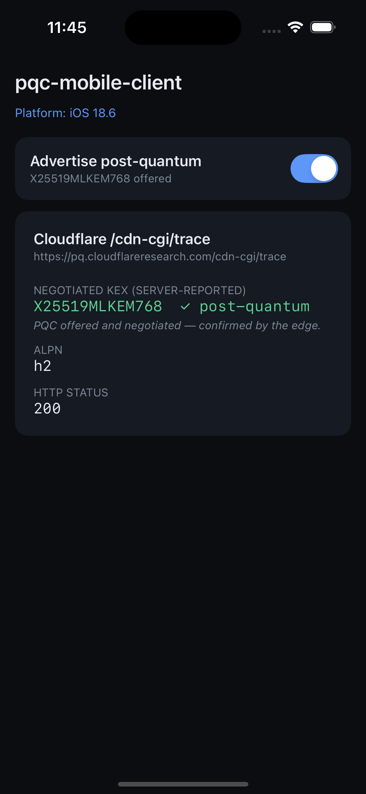

# Native iOS example

A minimal **pure-native iOS** app (SwiftUI, no React Native) that calls
`PqcHttpClient` directly, opens a Post-Quantum TLS connection to
`pq.cloudflareresearch.com`, and reports the negotiated key-exchange group
from the server's `/cdn-cgi/trace` report.

One screen — a post-quantum toggle and a live result card, styled to match the
[React Native sample](../RnSample). The toggle drives `enablePostQuantum`, so
flipping it off makes the edge report `kex=X25519` (classical). The result card
shows the server-reported KEX (green = `X25519MLKEM768`, amber = classical),
the negotiated ALPN, and the HTTP status:

<p align="center">
  
</p>

## How it consumes the library

Unlike the [Install](../../README.md#install) docs (which pull the published
SwiftPM/CocoaPods product), this sample wires up the **locally-built outputs**:

| What | Where it comes from |
|---|---|
| `PqcCore.xcframework` (static, arm64 + simulator) | `../../generated/PqcCore.xcframework` |
| UniFFI Swift bindings (`pqc.swift`) | `../../generated/swift/pqc.swift` |
| `Security.framework`, `libc++` | linked via `OTHER_LDFLAGS` |

Because `pqc.swift` is compiled **directly into the app target**, the
`PqcHttpClient`/`PqcConfig` types live in the app's own module — so
`ContentView.swift` has **no `import PqcCore`**. (When you instead consume the
published SwiftPM/CocoaPods product, the bindings are in the `PqcCore` module
and you *do* `import PqcCore` — see [`docs/ios.md`](../../docs/ios.md).)

## Prerequisites

1. **Build the XCFramework + bindings once** (from the repo root):

   ```bash
   make ios
   ```

   This produces `generated/PqcCore.xcframework` and
   `generated/swift/pqc.swift` — both `.gitignore`d, both referenced by this
   project via relative path. Re-run it whenever you change the Rust crate.

2. **Xcode 15+** (developed against Xcode 26). Building to a *physical device*
   needs a signing team; building to the *simulator* does not.

## Build & run

**Xcode:** open `examples/NativeIos/NativeIos.xcodeproj`, choose a simulator
(or your device + a signing team under Signing & Capabilities), press Run.

**Command line (simulator, no signing):**

```bash
cd examples/NativeIos
xcodebuild -scheme NativeIos -sdk iphonesimulator \
  -destination 'generic/platform=iOS Simulator' \
  CODE_SIGNING_ALLOWED=NO build
```

## Notes

- **Deployment target is iOS 15** (the SwiftUI `App` lifecycle needs 14+).
  The *library* floor is iOS 13; a UIKit shell would reach it, but SwiftUI
  keeps the sample short.
- On **iOS 26+**, native `URLSession` already negotiates `X25519MLKEM768`, so
  a real app would gate the custom path behind `if #available(iOS 26, *)`
  (see [`docs/ios.md`](../../docs/ios.md) §7). This sample always uses the
  Rust client so the demo is identical on every OS version.
- `Info.plist` sets `ITSAppUsesNonExemptEncryption = true` — bundling Rust
  crypto makes this a "uses non-exempt encryption" app (export compliance,
  `docs/ios.md` §8).

## Files

```
NativeIos/
├── NativeIos.xcodeproj/project.pbxproj   # links the local XCFramework + Security + libc++
└── NativeIos/
    ├── NativeIosApp.swift                # @main SwiftUI App
    ├── ContentView.swift                 # the toggle + result card + PQC call
    └── Info.plist
```

See [`docs/ios.md`](../../docs/ios.md) for the production integration patterns
(`URLProtocol` drop-in, Alamofire/Moya, cert pinning).
